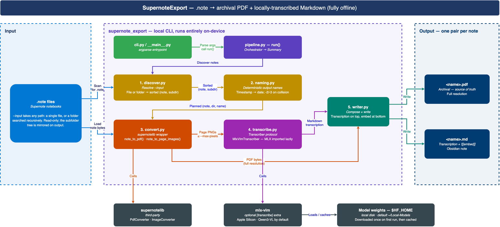

# Architecture — SupernoteExport

SupernoteExport is a single-process, offline CLI. It reads Supernote `.note`
files and writes two artifacts per note: an **archival PDF** and a **Markdown
note** whose body is a local vision-language-model transcription of the
handwriting, with the PDF embedded at the bottom.

Everything runs on-device. There is no server, no queue, no database, and no
network call at conversion time — the one exception being the first transcription
run, which downloads the model weights into the local Hugging Face cache; after
that, conversion is fully offline.



## The shape of the system

The design is a **linear pipeline with one deliberate fork**. `pipeline.run()`
plans the whole batch first (discover, then name), then loops over notes. For
each note, `convert.py` produces two *independent* renderings of the same
source:

| Path | Renderer | Resolution | Consumer |
|------|----------|-----------|----------|
| PDF | `supernotelib.PdfConverter` | Full (~4.9M px/page) | Embedded in the `.md` — the archival record |
| Page images | `supernotelib.ImageConverter` | Downscaled to `--max-pixels` (default 1.5M) | The VLM, which transcribes them |

**The two paths never meet.** The VLM never reads the PDF, and the PDF is never
downscaled. The transcription path's cap is applied up front, by shrinking the PNG
before any model touches it — model-agnostic, independent of the VLM's own processor
internals. This is what lets the transcription be lossy-but-useful while the embedded
PDF stays pixel-exact: any transcription error is one glance away from the original.
It's also why the resolution cap can be aggressive without degrading the archive.

## Modules

Each module has one responsibility and, apart from `pipeline`, no knowledge of
the others.

| Module | Responsibility |
|--------|---------------|
| `cli.py` / `__main__.py` | argparse entrypoint; builds a transcriber unless `--no-transcribe`, then calls `pipeline.run()`. |
| `discover.py` | Resolve `--input` (a file or a folder) into sorted `(note_path, relative_subdir)` pairs. The subdir is what mirrors the input tree under `--output`. |
| `naming.py` | Derive each output base name: a `YYYYMMDD_HHMMSS` stem becomes `YYYY-MM-DD`; any other stem is kept verbatim. Collisions within an output directory get `-2`/`-3`. |
| `convert.py` | Wrap `supernotelib`: `note_to_pdf()` and `note_to_page_images()`. Owns the pre-render pixel cap. |
| `transcribe.py` | Define the `Transcriber` protocol, the pure `assemble_transcription()` (page joining / `--page-markers`), and the `MlxVlmTranscriber` implementation. |
| `writer.py` | Compose the Markdown (transcription on top, `![[embed]]` at the bottom) and write both files. |
| `pipeline.py` | Orchestrate the above; catch per-note failures; return a `Summary`. |

## Design decisions worth knowing

**Transcription sits behind a protocol.** `pipeline` depends only on
`transcribe_pages(images) -> str`, so the integration test injects a fake and
exercises the real `supernotelib` conversion path without loading a multi-gigabyte
model. It's also the seam for swapping in a different model or backend.

**MLX is imported lazily**, inside `MlxVlmTranscriber` methods rather than at
module scope. `--no-transcribe` runs and the entire test suite therefore never
load MLX. This is also what lets `mlx-vlm` be the optional `[transcribe]` extra
rather than a hard dependency, so the base install runs on any platform.

**The weights location is not ours to choose.** `transcribe.py` sets no environment
variables, so model weights land in the standard Hugging Face cache
(`~/.cache/huggingface`), and `HF_HOME` relocates them exactly as it does for every
other Hugging Face tool.

**Naming is deterministic and filesystem-independent.** `plan_output_names()`
works in two passes. The first reserves the stems you chose on the device; the
second hands out date-derived names around them. So a name you picked is never
taken by a generated suffix, whatever the input order. It disambiguates from
input order alone and never probes the disk, so a rerun produces identical names.
That's what makes skip-on-rerun and `--overwrite` stable rather than
order-dependent. Names are stable *within* a run: two runs that see different
notes still hand out different names (see ROADMAP).

**One bad note cannot abort a batch.** `pipeline.run()` wraps each note in
`try/except`, records the failure in `Summary.failed`, and continues. The CLI
exits non-zero if anything failed, after printing every failure.

**The page-image cap is a correctness constraint, not a performance tweak.**
Above roughly 2M pixels, the Qwen3-VL vision stack intermittently returns an
*empty* generation — silently producing embed-only Markdown. Measured: reliable
at ≤1.77M px, empty at ≥2.0M on a failing page. The default of 1.5M sits below
that boundary. Do not raise it toward 2M. `note_to_page_images` downscales each
page before handing it to the model — a pre-render cap that works for any VLM,
rather than relying on a specific model's processor internals. The default is a
deliberately hard-coded conservative constant: it cannot be safely derived from
model metadata, because the cliff is undocumented and sits *below* every capacity
the model declares (its `size.longest_edge` is 16.7M; its `num_position_embeddings`
math implies ~2.36M — both empirically produce empty output).

## Data flow

```
.note ──┬── note_to_pdf()        → PDF bytes (full resolution) ──────────┐
        │                                                                 ▼
        └── note_to_page_images() → PNGs (≤ --max-pixels) → VLM → text → writer
                                                                          │
                                                        <name>.pdf  ◄─────┤
                                                        <name>.md   ◄─────┘
```

Skip logic short-circuits before any conversion: if both `<name>.md` and
`<name>.pdf` exist and `--overwrite` wasn't passed, the note is recorded as
skipped and neither renderer runs. Requiring both is what stops a lost PDF from
leaving a broken embed for good. `write_note_outputs` stages each artifact in a
temp file and renames it into place, so a file that exists is one that was
written in full — which is what makes "it exists" a sound proxy for "it was
converted". It is not a durability guarantee, and the two renames are not one
transaction (see ROADMAP).

## Testing strategy

The deterministic layers (`discover`, `naming`, `writer`, `convert`'s downscaler
and page-cap, `transcribe`'s `assemble_transcription` and fence-stripper, and the
`cli` parser + progress printer) are unit-tested. One test spawns a subprocess to
assert that importing `transcribe` leaves `HF_HOME` untouched — import-time
environment effects are only observable on a fresh interpreter.

`pipeline` has an integration test that converts a **committed sample `.note`**
(`tests/fixtures/20260717_012708.note`) through real `supernotelib` while faking
only the `Transcriber`. Shipping the fixture means this coverage of the real
`supernotelib` boundary runs anywhere, with no setup — and the fixture's timestamp
name doubles as coverage of `naming.py`'s date conversion. A `.gitignore` negation
commits just this one sample while blocking any other `.note` from the fixtures dir.

The VLM itself has no unit test by design: its output is non-deterministic and it
needs a large model. Instead there's an **opt-in eval** (`tests/test_vlm_eval.py`,
marked `vlm`, deselected by default) that runs the real model on the fixture through
the whole pipeline and asserts *tolerant* properties — non-empty output plus a few
clearly-printed anchors — rather than an exact transcription. It guards the resolution
cliff below, whose signature is a silently empty (embed-only) `.md`, and skips when the
model isn't cached.

Beyond the eval, the VLM is verified by running it and reading the result.

## Regenerating the diagram

The diagram is generated, not hand-drawn, so it round-trips without diff churn:

```bash
python docs/architecture/build_architecture.py
python ~/.claude/skills/drawio/scripts/validate.py docs/architecture/supernote-export-architecture.drawio
python ~/.claude/skills/drawio/scripts/render_png.py docs/architecture/supernote-export-architecture.drawio
mv docs/architecture/supernote-export-architecture.drawio.png docs/architecture/supernote-export-architecture.png
```

`build_architecture.py` documents its reserved routing corridors at the top; edit
it rather than the `.drawio` XML. The validator checks geometry only, so if you
move boxes, look at the rendered PNG too — a clean validation doesn't mean the
result reads well.
